#Github repositories

[](https://travis-ci.org/krmroland/interview_foundation)
<a href='https://coveralls.io/github/krmroland/interview_foundation?branch=master'></a>

## My favorite Github Repositories
# Running the repo
- after cloning the repo 
- run composer install to pull in the php packages
- run npm install to pull in js packages
- run npm run dev to compile the front end assets
- and php artisan serve (or valet for mac users) to serve the php application
## Screen-shots

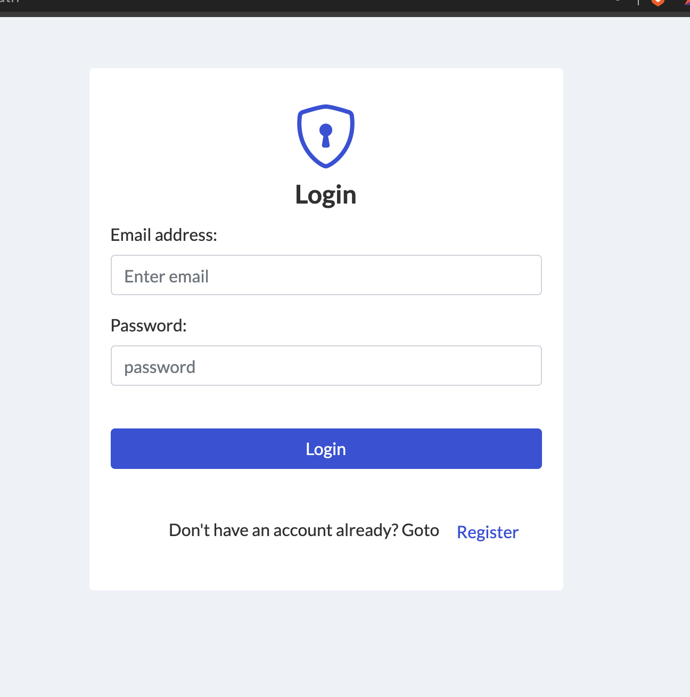
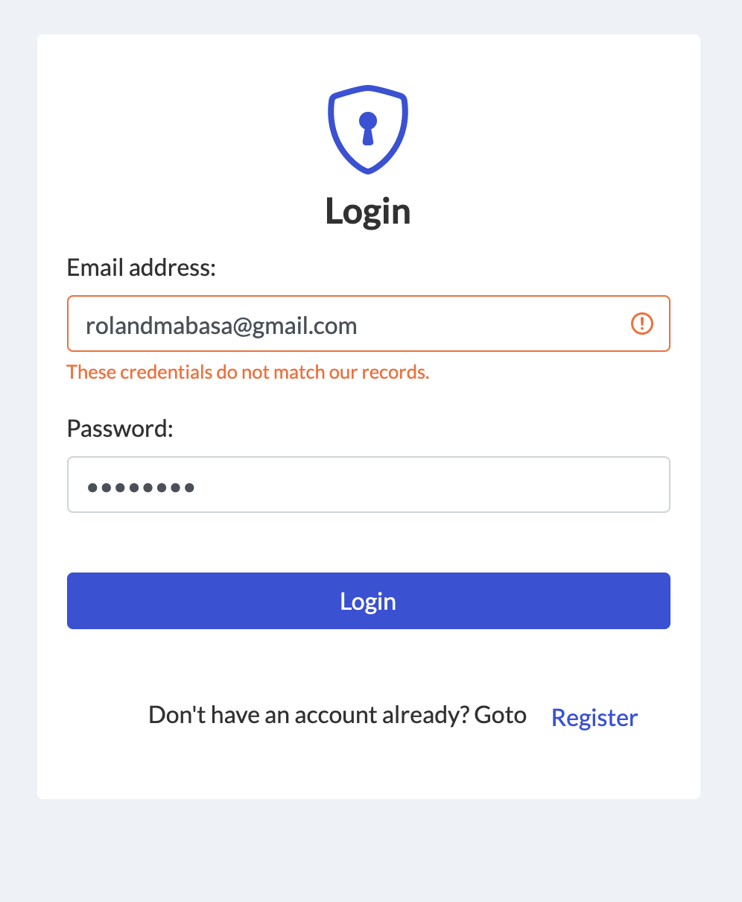
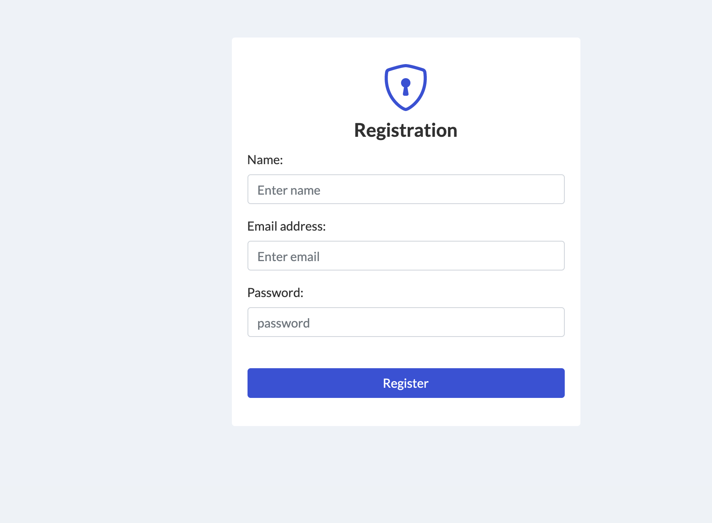
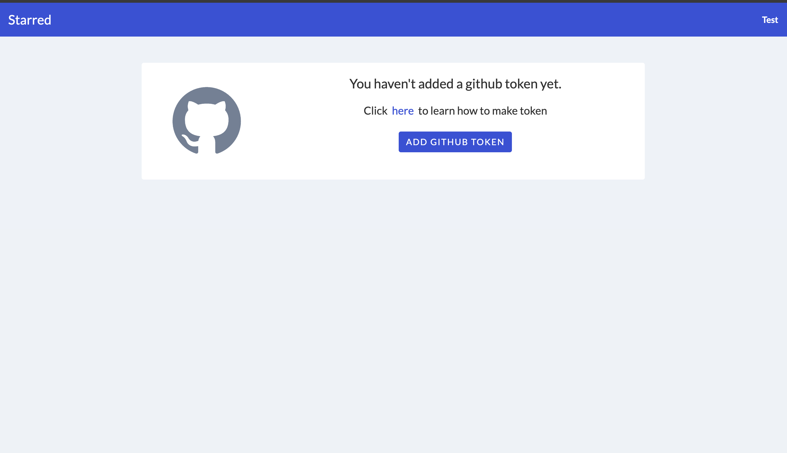
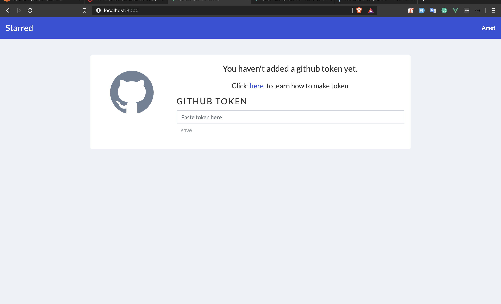
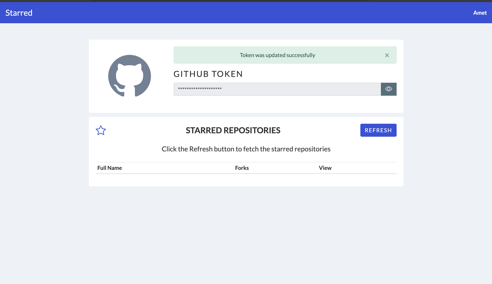
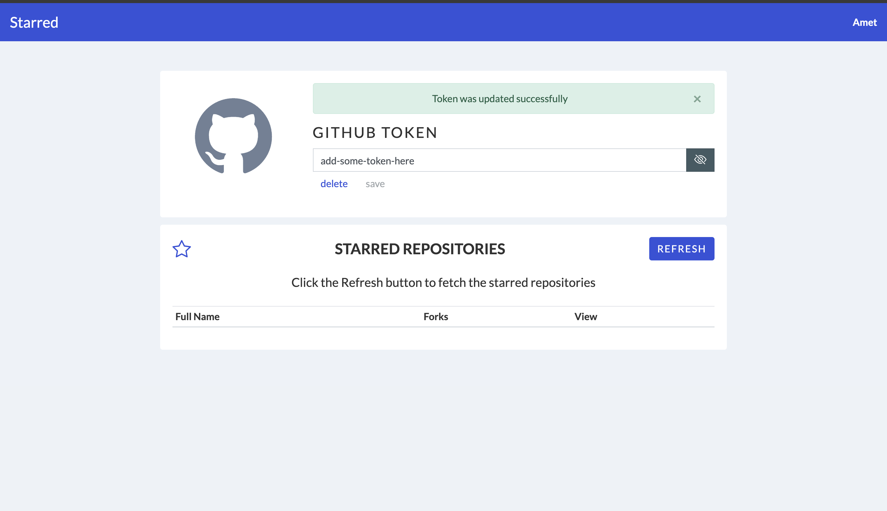
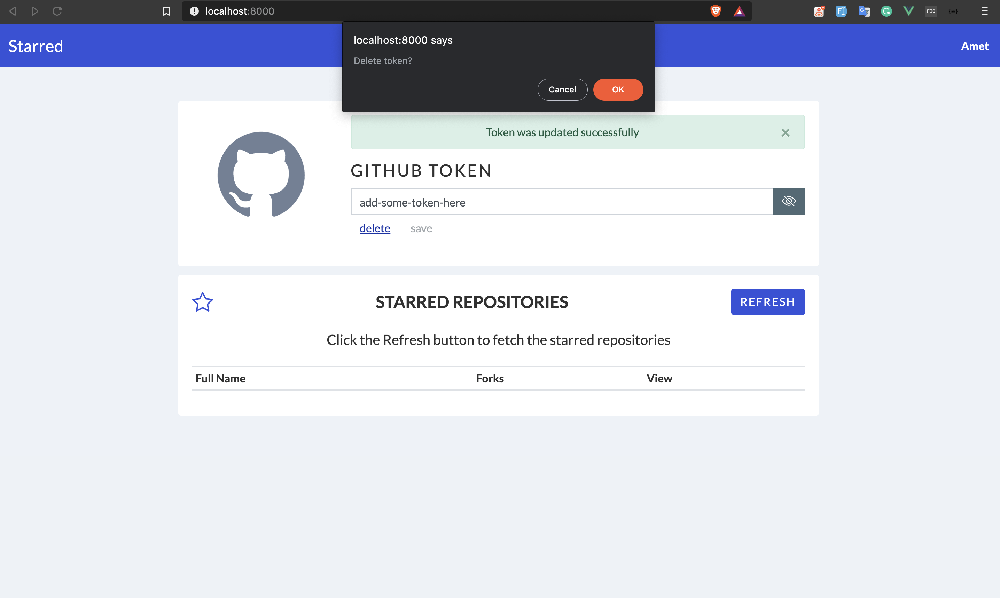
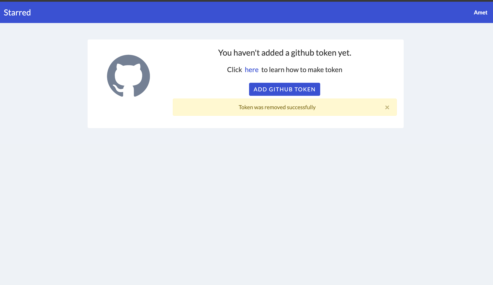
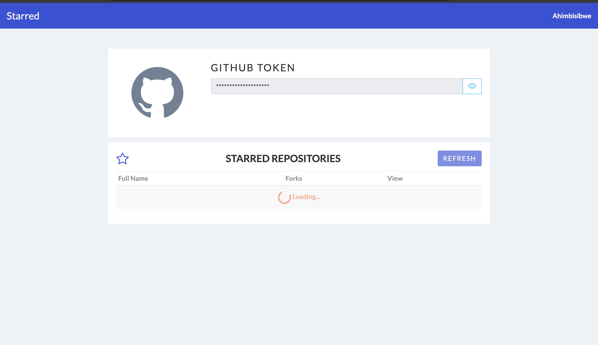
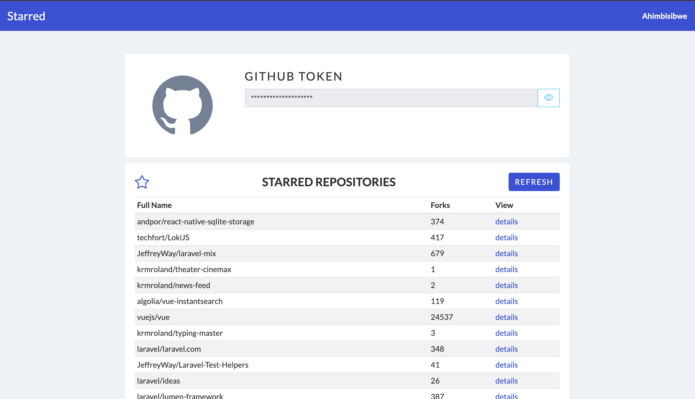
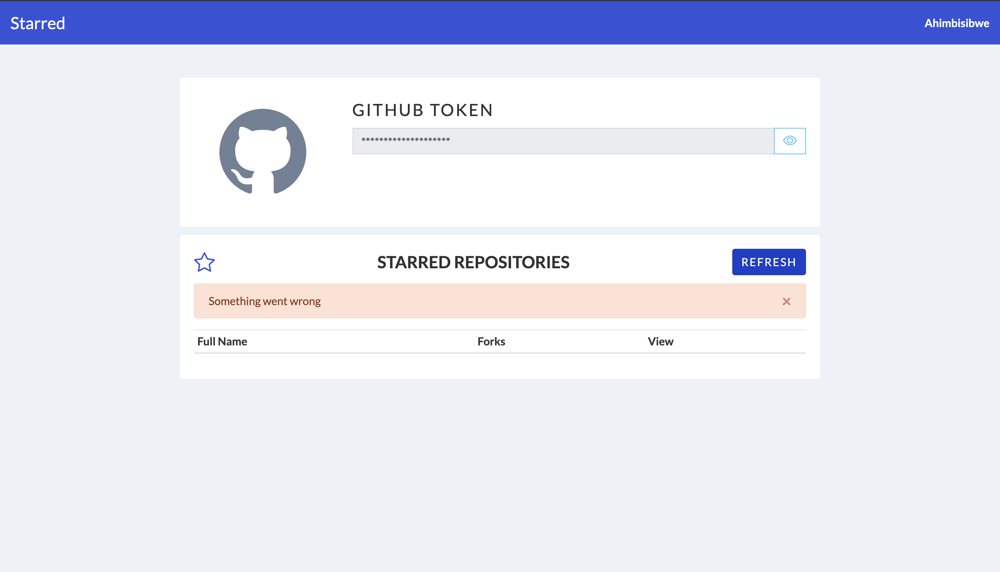

### Todo

- Validate token using github API before persisting

## The business stories

```
Feature: Github API Integration
  As a user of the site
  I want to add my github token to a form
  So I can then see my starred repos

Scenario: User can log in
  Given I view the home page
  Then I should see a login button
  And when I click that then I should be logged in
  And redirected back to the home page

Scenario: Form on Home page to add my Github token
  Given I am logged in
  Then I can add my github token to a form
  And click save
  Then it will be encrypted in the database in the user table
  ****Then**** the home page will show that token decrypted
  And if the token is null it will say "No Token? Click here to learn how to make token"
  And it will link in a new tab to github docs so user knows how to make a token

Scenario: Press button to get starred repos
  Given I am logged in
  And I setup my token
  Then I will see a button to get starred repos
  And if I have not set my token this will be grayed out
  And if I click that it will say "Getting your data" while it makes the request
  And axios will make a request to a protected api route on our app that then will call github to get the data
  And when it gets the starred repos it will show them on the home page
```
